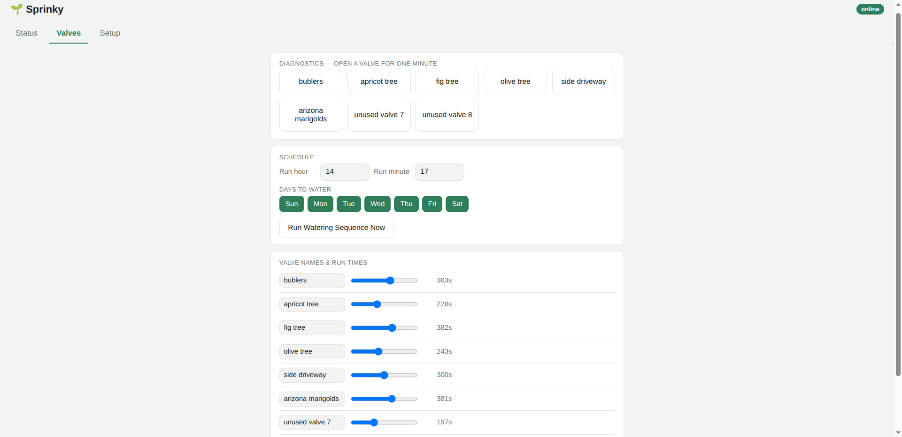

# Sprinky

A WiFi-connected landscape sprinkler controller for the ESP32 and ESP8266,
with a clean web dashboard, temperature-adjusted watering times, and
optional Home Assistant integration.

<p align="center">
  
  
</p>

## Why Sprinky is easy to set up

Sprinky is designed to run on almost any ESP32 or ESP8266 relay board you
can find — the cheap multi-relay boards sold for home automation projects
(the kind commonly found from Chinese sellers on Alibaba/AliExpress/eBay)
work fine, as do hand-wired boards. There's no proprietary hardware
requirement and no PCB to order.

**The only thing you have to configure for your specific board is which
GPIO pins drive your relays.** That's a single array in `config.h`:

```cpp
static const uint8_t relay[NUM_RELAYS] = { 32, 33, 25, 26, 27, 14, 12, 13 };
```

Replace those pin numbers with whichever GPIO pins your board actually
wires to its relay inputs (check your board's silkscreen or datasheet),
set `RELAY8` (below) to match how many valves you have, and you're
running. Everything else — scheduling, the web UI, WiFi setup, temperature
scaling, OTA updates — works identically regardless of which board you
used.

<p align="center">
  
  <br>
  <em>An example 8-relay board wired into a weatherproof enclosure — any similar board works.</em>
</p>

A temperature sensor is **optional**. Sprinky waters on schedule either
way — a sensor just lets it shorten or extend run times based on outdoor
temperature. See [Temperature-adjusted watering](#temperature-adjusted-watering)
below for what to expect if you skip it.

## What you need

- An ESP32 or ESP8266 development board
- A relay board (4 or 8 channel) to switch your sprinkler valves' solenoids
- *(Optional)* A DS18B20 temperature sensor, or a simple analog diode
  wired to an ADC pin, for temperature-adjusted watering
- A USB cable and the Arduino IDE (or `arduino-cli`) to flash the firmware

No app to install, no cloud account, no subscription. Once flashed, you
control everything from a web page served by the device itself.

## Quick start

1. **Install the Arduino IDE** (2.x) and add ESP32/ESP8266 board support
   via the Boards Manager if you haven't already.
2. **Install the required libraries** through the Arduino Library
   Manager (Sketch → Include Library → Manage Libraries): ESPAsyncWebServer
   (the actively-maintained `ESP32Async` fork), ArduinoJson, ElegantOTA,
   arduino-timer, CircularBuffer, NTPClient, Timezone, and — if you're
   using a DS18B20 sensor — DallasTemperature and OneWire. See
   [CLAUDE.md](CLAUDE.md) for the full pinned dependency list.
3. **Set `ELEGANTOTA_USE_ASYNC_WEBSERVER` to `1`** for the ElegantOTA
   library — this is required so OTA updates share the same web server as
   the dashboard. (See the [ElegantOTA docs](https://github.com/ayushsharma82/ElegantOTA).)
4. **Edit `config.h`** for your hardware (see [Configuring your hardware](#configuring-your-hardware)
   below) — at minimum, set the `relay[]` pin array to match your board's
   wiring and set `RELAY8` to match your valve count.
5. **Flash the sketch** to your board over USB.
6. **Connect to the controller.** On first boot (or any time it can't
   connect to a saved WiFi network), it creates its own WiFi access point
   named after `HOSTNAME` in `config.h`, reachable at `192.168.4.1`.
   Connect to that network with your phone or laptop, open
   `http://192.168.4.1` in a browser, and enter your home WiFi's SSID and
   password on the Setup tab.
7. **Reboot** (or it will reconnect automatically) and the controller
   joins your WiFi network. From then on, find it at
   `http://<HOSTNAME>.local/` (mDNS) from any device on the same network.

That's the whole setup. Everything past this point — naming valves,
setting run times, scheduling — is done from the web dashboard, no
re-flashing required.

## Using the dashboard

Once connected, the web dashboard has three tabs:

- **Status** — current time, outside temperature, 24-hour average
  temperature, WiFi signal strength, last completed run's total duration,
  a master watering on/off switch, and a live debug log.
- **Valves** — a "test" button per valve (runs it for up to a minute,
  useful for checking wiring or manually watering one zone), an editable
  name and run-time slider per valve, which days of the week the schedule
  is allowed to run on, the daily start time, and a "Run Watering Sequence
  Now" button to trigger the full schedule on demand.
- **Setup** — WiFi credentials, time zone selection, a link to the
  firmware update page, and a reboot button.

<p align="center">
  
</p>


Changes you make (valve names, run times, schedule, WiFi credentials,
time zone) are saved to the device's flash storage and survive power
loss and reboots.

## Scheduling

Set a daily start time and which days of the week to water on. When that
time arrives (and today is an active day), Sprinky runs through each
valve in sequence for its configured duration, one at a time — never more
than one valve open at once. A safety timer force-stops the whole cycle
after a fixed maximum (80 minutes), and any manually-triggered valve test
automatically shuts off after a minute, so a network hiccup or a
forgotten browser tab can't leave a valve running indefinitely.

## Temperature-adjusted watering

Sprinky keeps a rolling 24-hour average outdoor temperature and scales
each valve's run time accordingly — longer waterings on hot days, shorter
on cool ones. The reading comes from a DS18B20 digital sensor if you
define `DS18B20` in `config.h` and wire one up, or otherwise from a
simple analog diode on the ADC pin.

If you don't want to wire up either sensor, leave `DS18B20` undefined —
but be aware the analog fallback reads whatever voltage happens to be on
the ADC pin, and with nothing connected that can be a meaningless (and
possibly unstable) value, which feeds directly into the run-time scaling.
There's currently no setting to disable temperature scaling outright, so
if you're skipping a sensor, it's worth wiring the ADC pin to a fixed
voltage (or checking the reported temperature on the dashboard looks sane)
rather than leaving it floating.

## Configuring your hardware

All hardware-specific settings live in `config.h`:

| Setting | What it controls |
|---|---|
| `HOSTNAME` | The device's name — used for its WiFi access point SSID and its `.local` mDNS address. Give each controller a unique name if you run more than one. |
| `RELAY8` | Define this if you have an 8-valve board; leave it commented out for a 4-valve board. |
| `relay[]` | **The important one.** GPIO pin number for each relay/valve, in order. Must match your specific board's wiring. |
| `ON` / `OFF` | Some relay boards are active-low (a `LOW` signal turns the relay on) and some are active-high. If your valves come on backwards from what you'd expect, swap these. |
| `DS18B20` | Define this if you've wired up a DS18B20 digital temperature sensor. Leave undefined to read from a simple analog diode on the ADC pin instead (works with no sensor attached too, though readings won't be meaningful). If `DS18B20` is defined but the sensor isn't detected at boot, readings fall back to a fixed default value. |
| `USE_WITH_HA` | Optional: enables Home Assistant integration over MQTT (see below). Off by default. |

Everything else — the web dashboard, scheduling logic, OTA update
mechanism, WiFi reconnect handling — works the same regardless of these
settings.

## Optional: Home Assistant integration

Defining `USE_WITH_HA` in `config.h` adds MQTT-based Home Assistant
integration (via the ArduinoHA library, an additional dependency only
needed for this feature): each valve appears as a switch, outdoor
temperature is reported as a sensor, and a dedicated switch can
disable/enable the whole watering system. Set your MQTT broker address
and credentials in the same block in `config.h`. This is entirely
optional — the controller is fully usable standalone without Home
Assistant or an MQTT broker.

## Firmware updates

Once the controller is on your network, you can push new firmware without
opening it back up over USB: the Setup tab has a firmware update link that
uses [ElegantOTA](https://github.com/ayushsharma82/ElegantOTA) to accept a
new `.bin` upload directly from the browser.

## A note on reliability

I've had a version of this running in my own garden for a couple of
years now with no watering mishaps or drowned plants, but as with any
hobbyist project controlling water valves, use it at your own risk — test
your setup, keep an eye on it after changes, and don't rely on it as your
only safeguard against, say, leaving a valve stuck open. It's a work in
progress, and contributions/bug reports are welcome.
