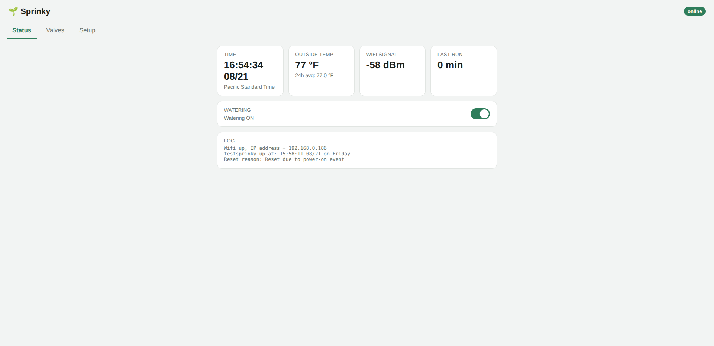
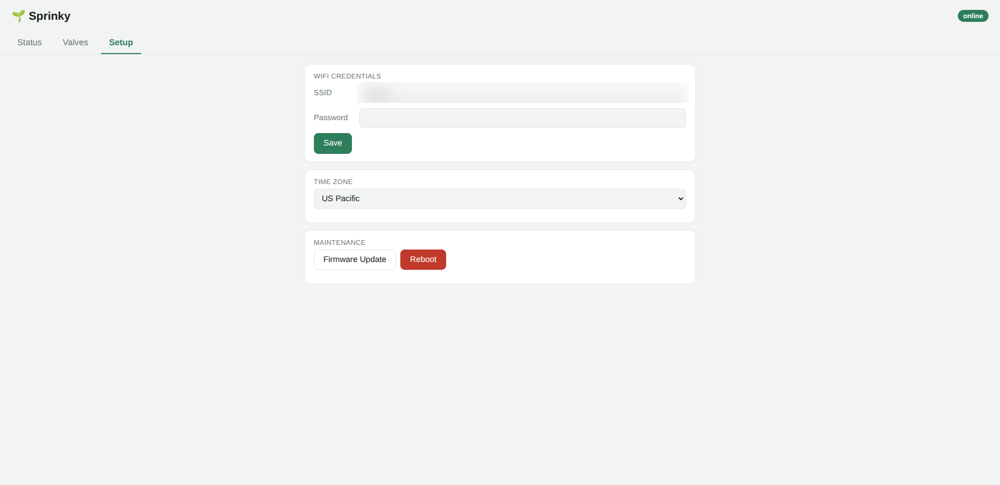
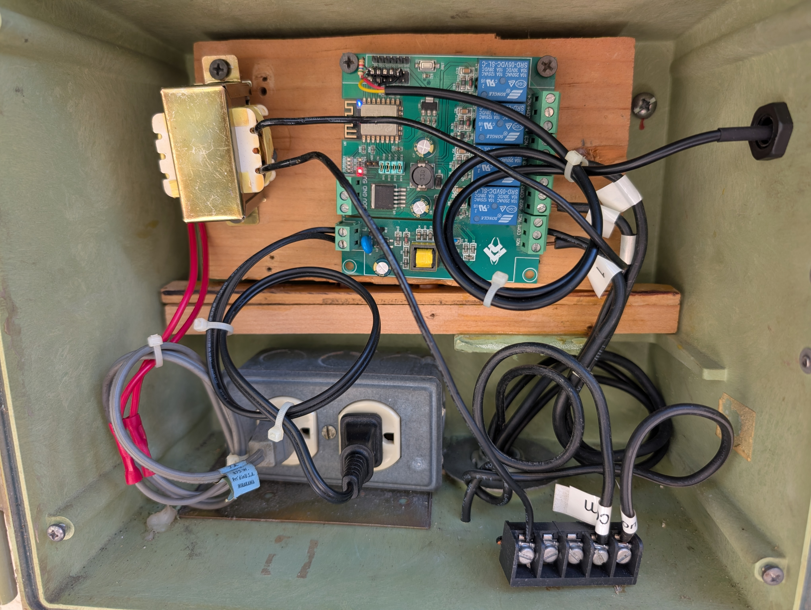
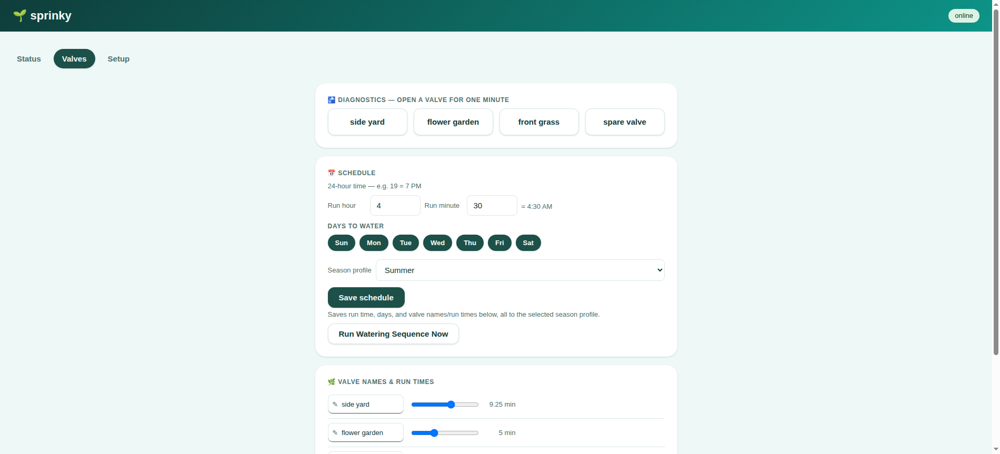

# Sprinky

A WiFi-connected landscape sprinkler controller for the ESP32 and ESP8266,
with a clean web dashboard and temperature-adjusted watering times.

<p align="center">
  
  
</p>

## Why Sprinky is easy to set up

Sprinky is designed to run on almost any ESP32 or ESP8266 relay board you
can find — the cheap multi-relay boards sold for home automation projects
(the kind commonly found from Chinese sellers on Alibaba/AliExpress/eBay)
work fine, as do hand-wired boards. There's no proprietary hardware
requirement and no PCB to order.

**The only thing you have to configure for your specific board is which
GPIO pins drive your relays.** That's a single array in `config.h`:

```cpp
static const uint8_t relay[] = { 32, 33, 25, 26, 27, 14, 12, 13 };
```

Replace those pin numbers with whichever GPIO pins your board actually
wires to its relay inputs (check your board's silkscreen or datasheet),
set `RELAY8` (below) to match how many valves you have, and you're
running. Everything else — scheduling, seasonal profiles, the web UI,
WiFi setup, temperature scaling, OTA updates — works identically
regardless of which board you used.

<p align="center">
  
  <br>
  <em>An example 8-relay board wired into a weatherproof enclosure — any similar board works.</em>
</p>

A temperature sensor is **optional**. Sprinky waters on schedule either
way — a sensor just lets it shorten or extend run times based on outdoor
temperature. See [Temperature-adjusted watering](#temperature-adjusted-watering)
below for what to expect if you skip it.

## What you need

- An ESP32 or ESP8266 development board
- A relay board (4 or 8 channel) to switch your sprinkler valves' solenoids
- *(Optional)* A DS18B20 temperature sensor, or a simple analog diode
  wired to an ADC pin, for temperature-adjusted watering
- A USB cable to flash the firmware the first time (updates after that can
  go over WiFi — see [Firmware updates](#firmware-updates))

No app to install, no cloud account, no subscription. Once flashed, you
control everything from a web page served by the device itself.

## Quick start

This is a [PlatformIO](https://platformio.org/) project. There is no
`.ino` sketch — the firmware is the `src/*.cpp` / `src/*.h` files
(`config.h` is in `src/` too), and all library versions are pinned in
`platformio.ini`.

1. **Install PlatformIO** — either the
   [PlatformIO IDE extension for VS Code](https://platformio.org/install/ide?install=vscode)
   or the CLI (`pip install platformio`).
2. **Open the project folder.** PlatformIO reads `platformio.ini` and
   downloads every pinned dependency automatically the first time you
   build — nothing to install by hand. (The required
   `ELEGANTOTA_USE_ASYNC_WEBSERVER=1` flag is already set there in
   `build_flags`, so OTA updates share the dashboard's web server.)
3. **Edit `config.h`** for your hardware (see [Configuring your hardware](#configuring-your-hardware)
   below) — at minimum, set the `relay[]` pin array to match your board's
   wiring and set `RELAY8` to match your valve count.
4. **Build and flash over USB:**
   - ESP8266: `pio run -e esp12e -t upload`
   - ESP32: `pio run -e esp32dev -t upload`

   (In the VS Code extension, pick the environment and hit Upload.) Watch
   the serial log with `pio device monitor` (115200 baud).
5. **Connect to the controller.** On first boot (or any time it can't
   connect to a saved WiFi network), it creates its own WiFi access point
   named after `HOSTNAME` in `config.h`, reachable at `192.168.4.1`.
   Connect to that network with your phone or laptop, open
   `http://192.168.4.1` in a browser, and enter your home WiFi's SSID and
   password on the Setup tab.
6. **Reboot** (or it will reconnect automatically) and the controller
   joins your WiFi network. From then on, find it at
   `http://<HOSTNAME>.local/` (mDNS) from any device on the same network.

That's the whole setup. Everything past this point — naming valves,
setting run times, scheduling — is done from the web dashboard, no
re-flashing required.

## Using the dashboard

Once connected, the web dashboard has three tabs:

- **Status** — current time, outside temperature (with a °F / °C toggle
  button), 24-hour average temperature, WiFi signal strength and the
  device's IP address, last completed run's total duration, a master
  watering on/off switch, and a live debug log.
- **Valves** — a "test" button per valve (runs it for up to a minute,
  useful for checking wiring or manually watering one zone), an editable
  name and run-time slider per valve, which days of the week the schedule
  is allowed to run on, and the daily start time (entered in 24-hour time,
  with a live 12-hour readout next to it so an evening schedule can't be
  mistaken for a morning one), plus a "Run Watering Sequence Now" button to
  trigger the full schedule on demand. This tab also has a **Temperature
  scaling** on/off toggle and a **season profile** selector (see
  [Seasonal schedule profiles](#seasonal-schedule-profiles) below).
- **Setup** — WiFi credentials, time zone selection (US zones plus common
  world zones — UK/GMT, Central European, Moscow, Australia Eastern,
  Brazil, South Africa, Gulf/Dubai, India, China, Japan), a link to the
  firmware update page, and a reboot button.

<p align="center">
  
</p>


Changes you make (valve names, run times, schedule, WiFi credentials,
time zone) are saved to the device's flash storage and survive power
loss and reboots.

## Scheduling

Set a daily start time and which days of the week to water on. When that
time arrives (and today is an active day), Sprinky runs through each
valve in sequence for its configured duration, one at a time — never more
than one valve open at once. A safety timer force-stops the whole cycle
after a fixed maximum (80 minutes), and any manually-triggered valve test
automatically shuts off after a minute, so a network hiccup or a
forgotten browser tab can't leave a valve running indefinitely.

## Seasonal schedule profiles

The Valves tab has a **season profile** selector (Summer / Fall / Winter /
Spring). Each season stores its own complete schedule — start time, active
days, and every valve's name and run time — so you can set watering up
once per season and switch between them instead of re-entering everything.

- **Selecting a season** immediately loads that profile's saved schedule
  and makes it the active one. The controller keeps running the
  last-selected season across reboots.
- **"Save this season"** writes the fields currently on screen into the
  selected season's slot.
- Only one profile is active at a time — Sprinky does **not** switch
  seasons automatically by date; you pick the season when it changes.

On first boot after updating to this firmware, your existing schedule is
copied into the **Summer** profile, so nothing is lost.

The Temperature scaling toggle is a single global setting, not per-season.

## Temperature-adjusted watering

Sprinky keeps a rolling 24-hour average outdoor temperature and scales
each valve's run time accordingly — longer waterings on hot days, shorter
on cool ones. The reading comes from a DS18B20 digital sensor if you
define `DS18B20` in `config.h` and wire one up, or otherwise from a
simple analog diode on the ADC pin. The Status tab shows the temperature
in either Fahrenheit or Celsius — use the °F / °C button on that card to
switch.

If you don't want to wire up either sensor, turn **Temperature scaling**
off on the Valves tab — run times are then used exactly as you set them,
regardless of the reported temperature. (Leaving scaling on with no sensor
and `DS18B20` undefined means the analog fallback reads whatever voltage
happens to be on the ADC pin, which can be a meaningless and unstable
value feeding straight into the run-time scaling.)

## Configuring your hardware

All hardware-specific settings live in `config.h`:

| Setting | What it controls |
|---|---|
| `HOSTNAME` | The device's name — used for its WiFi access point SSID and its `.local` mDNS address. Give each controller a unique name if you run more than one. |
| `RELAY8` | Define this if you have an 8-valve board; leave it commented out for a 4-valve board. |
| `relay[]` | **The important one.** GPIO pin number for each relay/valve, in order. Must match your specific board's wiring. |
| `RELAY_ACTIVE` / `RELAY_INACTIVE` | Some relay boards are active-low (a `LOW` signal turns the relay on) and some are active-high. If your valves come on backwards from what you'd expect, swap these. |
| `DS18B20` | Define this if you've wired up a DS18B20 digital temperature sensor. Leave undefined to read from a simple analog diode on the ADC pin instead (works with no sensor attached too, though readings won't be meaningful). If `DS18B20` is defined but the sensor isn't detected at boot, readings fall back to a fixed default value. |

Everything else — the web dashboard, scheduling logic, OTA update
mechanism, WiFi reconnect handling — works the same regardless of these
settings.

## Firmware updates

Once the controller is on your network, you can push new firmware without
opening it back up over USB: the Setup tab has a firmware update link that
uses [ElegantOTA](https://github.com/ayushsharma82/ElegantOTA) to accept a
new `.bin` upload directly from the browser.

## A note on reliability

I've had a version of this running in my own garden for a couple of
years now with no watering mishaps or drowned plants, but as with any
hobbyist project controlling water valves, use it at your own risk — test
your setup, keep an eye on it after changes, and don't rely on it as your
only safeguard against, say, leaving a valve stuck open. It's a work in
progress, and contributions/bug reports are welcome.
