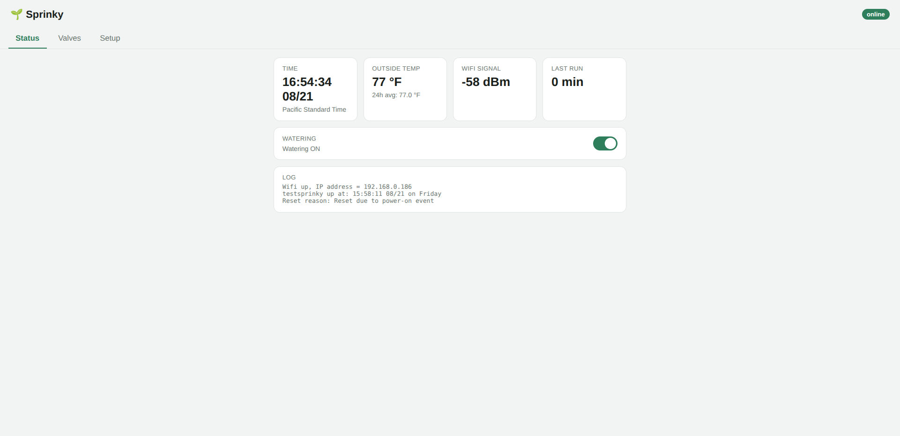
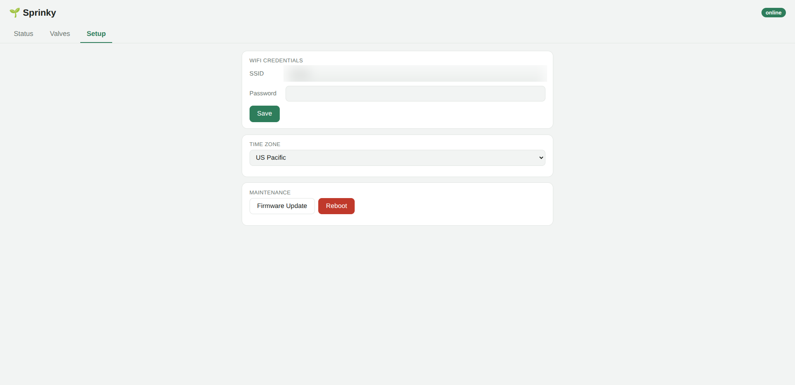
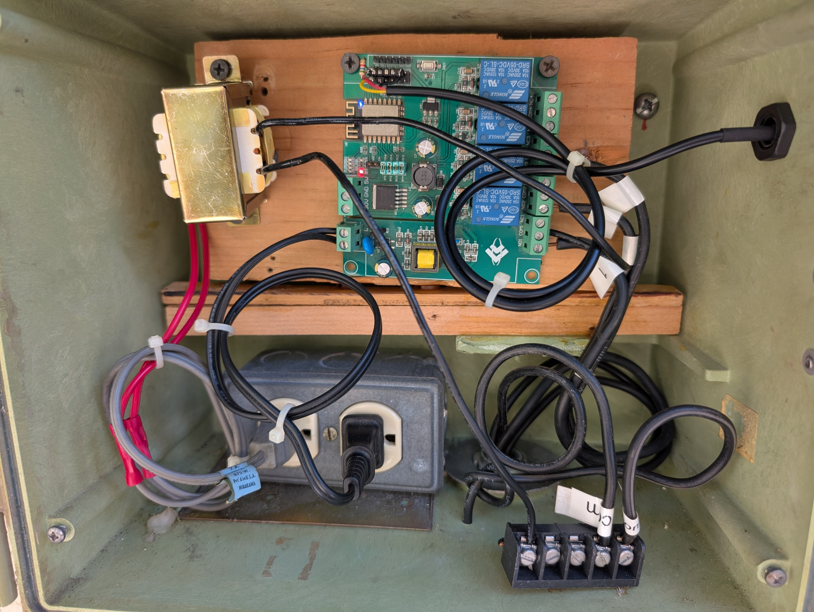
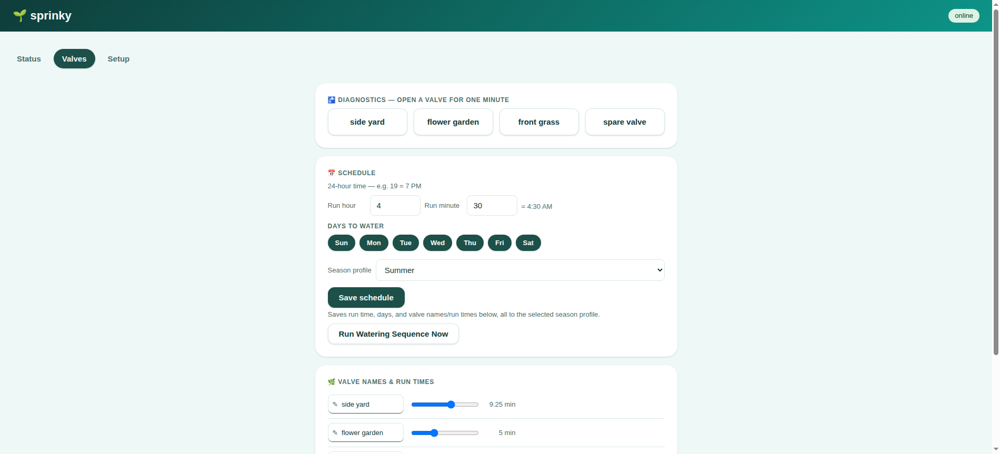

# Sprinky

A WiFi-connected landscape sprinkler controller for the ESP32 and ESP8266,
with a clean web dashboard and temperature-adjusted watering times.

<p align="center">
  
  
</p>

## Why Sprinky is easy to set up

Sprinky is designed to run on almost any ESP32 or ESP8266 relay board you
can find — the cheap multi-relay boards sold for home automation projects
(the kind commonly found from Chinese sellers on Alibaba/AliExpress/eBay)
work fine, as do hand-wired boards. There's no proprietary hardware
requirement and no PCB to order.

**The only thing you have to configure for your specific board is which
GPIO pins drive your relays.** That's a single array in `config.h`:

```cpp
static const uint8_t relay[] = { 32, 33, 25, 26, 27, 14, 12, 13 };
```

Replace those pin numbers with whichever GPIO pins your board actually
wires to its relay inputs (check your board's silkscreen or datasheet),
set `RELAY8` (below) to match how many valves you have, and you're
running. Everything else — scheduling, seasonal profiles, the web UI,
WiFi setup, temperature scaling, OTA updates — works identically
regardless of which board you used.

<p align="center">
  
  <br>
  <em>An example 8-relay board wired into a weatherproof enclosure — any similar board works.</em>
</p>

A temperature sensor is **optional**. Sprinky waters on schedule either
way — a sensor just lets it shorten or extend run times based on the
weather. See [Temperature-adjusted watering](#temperature-adjusted-watering)
below for what to expect if you skip it.

## What you need

- An ESP32 or ESP8266 development board
- A relay board (4 or 8 channel) to switch your sprinkler valves' solenoids
- *(Optional)* A DS18B20 temperature sensor, or a silicon diode (e.g.
  1N914) wired to the A0 analog input, for temperature-adjusted watering
- A USB cable to flash the firmware the first time (updates after that can
  go over WiFi — see [Firmware updates](#firmware-updates))

No app to install, no cloud account, no subscription. Once flashed, you
control everything from a web page served by the device itself.

## Quick start

This is a [PlatformIO](https://platformio.org/) project. There is no
`.ino` sketch — the firmware is the `src/*.cpp` / `src/*.h` files
(`config.h` is in `src/` too), and all library versions are pinned in
`platformio.ini`.

1. **Install PlatformIO** — either the
   [PlatformIO IDE extension for VS Code](https://platformio.org/install/ide?install=vscode)
   or the CLI (`pip install platformio`).
2. **Open the project folder.** PlatformIO reads `platformio.ini` and
   downloads every pinned dependency automatically the first time you
   build — nothing to install by hand. (The required
   `ELEGANTOTA_USE_ASYNC_WEBSERVER=1` flag is already set there in
   `build_flags`, so OTA updates share the dashboard's web server.)
3. **Edit `config.h`** for your hardware (see [Configuring your hardware](#configuring-your-hardware)
   below) — at minimum, set the `relay[]` pin array to match your board's
   wiring and set `RELAY8` to match your valve count.
4. **Build and flash over USB:**
   - ESP8266: `pio run -e esp12e -t upload`
   - ESP32: `pio run -e esp32dev -t upload`

   (In the VS Code extension, pick the environment and hit Upload.) Watch
   the serial log with `pio device monitor` (115200 baud).
5. **Connect to the controller.** On first boot (or any time it can't
   connect to a saved WiFi network), it creates its own WiFi access point
   named after `HOSTNAME` in `config.h`, reachable at `192.168.4.1`.
   Connect to that network with your phone or laptop, open
   `http://192.168.4.1` in a browser, and enter your home WiFi's SSID and
   password on the Setup tab.
6. **Reboot** (or it will reconnect automatically) and the controller
   joins your WiFi network. From then on, find it at
   `http://<HOSTNAME>.local/` (mDNS) from any device on the same network.

That's the whole setup. Everything past this point — naming valves,
setting run times, scheduling — is done from the web dashboard, no
re-flashing required. For your first few weeks, we recommend running
with temperature scaling off — see
[Recommended: set up with scaling off first](#recommended-set-up-with-scaling-off-first).

## Using the dashboard

Once connected, the web dashboard has three tabs:

- **Status** — current time, outside temperature (with a °F / °C toggle
  button), 24-hour average temperature, WiFi signal strength and the
  device's IP address, last completed run's total duration, a master
  watering on/off switch, and a live debug log.
- **Valves** — a "test" button per valve (runs it for up to a minute,
  useful for checking wiring or manually watering one zone), an editable
  name and run-time slider per valve, which days of the week the schedule
  is allowed to run on, and the daily start time (entered in 24-hour time,
  with a live 12-hour readout next to it so an evening schedule can't be
  mistaken for a morning one), plus a "Run Watering Sequence Now" button to
  trigger the full schedule on demand. This tab also has a **Temperature
  scaling** on/off toggle and a **season profile** selector (see
  [Seasonal schedule profiles](#seasonal-schedule-profiles) below).
- **Setup** — WiFi credentials, time zone selection (US zones plus common
  world zones — UK/GMT, Central European, Moscow, Australia Eastern,
  Brazil, South Africa, Gulf/Dubai, India, China, Japan), the site
  **location** (see below), a link to the firmware update page, and a
  reboot button.

**Location.** Sprinky needs its latitude and longitude for temperature
scaling and to pick the right season dates. There's nothing to set up:
after each boot it looks up an approximate location (usually your city)
from your internet connection, using the free [ip-api.com](https://ip-api.com)
service. The Location card on the Setup tab shows the result. If it's
wrong — some internet providers report a city far away — type your own
latitude and longitude (decimal degrees, north and east positive; any map
app will show them) and press **Save**. Values you enter are kept until you
press **Use automatic location**. If the lookup fails, Sprinky uses the
last location it found, or the defaults in `config.h`.

<p align="center">
  
</p>


Changes you make (valve names, run times, schedule, WiFi credentials,
time zone, location) are saved to the device's flash storage and survive power
loss and reboots.

## Scheduling

Set a daily start time and which days of the week to water on. When that
time arrives (and today is an active day), Sprinky runs through each
valve in sequence for its configured duration, one at a time — never more
than one valve open at once.

Several independent safeguards keep a valve from being left running:

- A **cycle safety timer** force-stops the whole cycle 5 minutes after it
  should have finished.
- A manually-triggered **valve test** shuts off automatically after a
  minute, so a network hiccup or a forgotten browser tab can't leave it
  running.
- A **valve watchdog**, checked continuously and independent of the
  timers, closes any valve that has stayed open more than a minute past
  its run time and logs a `SAFETY:` line on the Status tab.
- If the firmware ever hangs, the chip's watchdog resets it, and every
  valve is closed at boot.

Software can't detect a welded relay or a mechanically stuck valve,
though — see [A note on reliability](#a-note-on-reliability).

## Seasonal schedule profiles

The Valves tab has a **season profile** selector (Summer / Fall / Winter /
Spring). Each season stores its own complete schedule — start time, active
days, and every valve's name and run time — so you can set watering up
once per season and switch between them instead of re-entering everything.

- **Automatic switching:** Sprinky switches to the matching profile on
  Mar 1 (Spring), Jun 1 (Summer), Sep 1 (Fall) and Dec 1 (Winter), once
  its clock has synced over the network. The seasons are flipped for the
  southern hemisphere (a negative latitude on the Setup tab). It never
  switches in the middle of a watering cycle.
- **Manual override:** selecting a season in the dropdown immediately
  loads that profile's saved schedule and makes it the active one. A
  manual pick holds until the next of those dates, then automatic
  switching takes over again. The active season is kept across reboots.
- **"Save schedule"** writes the fields currently on screen into the
  selected season's slot.
- Only one profile is active at a time.

On first boot after updating to this firmware, your existing schedule is
copied into the **Summer** profile, so nothing is lost.

The Temperature scaling toggle is a single global setting, not per-season.

## Temperature-adjusted watering

With **Temperature scaling** on, Sprinky adjusts every valve's run time to
how much water the garden is actually losing — longer on hot, sunny days,
shorter on cool or overcast ones.

**How it works.** It uses the Hargreaves equation (FAO-56), the standard
way irrigation controllers estimate evapotranspiration (ET₀, the water a
lawn loses per day) when only temperature is measured. ET₀ is calculated
from the last 24 hours of hourly readings (the average temperature and
the gap between the day's high and low) plus the strength of the sun for
your latitude and the date. The run-time factor is today's ET₀ divided by
the ET₀ of a typical day for the active season (set in `config.h`). Your
configured run times therefore mean "a typical day in this season", and
the factor only corrects for today being hotter or cooler than that. The
factor is limited to 0.25×–2.0×, and each run logs the values it used
on the Status tab.

**Temperature sensors.** Sprinky checks these on every reading, using the
first one that works:

1. a **DS18B20** digital sensor on `TEMP_PIN` (if `DS18B20` is defined in
   `config.h`)
2. a **silicon diode** on the A0 analog input, if its voltage is in the
   range a forward-biased diode gives
3. **Open-Meteo's** current air temperature for your location, if neither
   sensor works and the controller is online (refreshed every 15 minutes).
   This is the modeled temperature for the surrounding 1–10 km, not your
   yard, so it's used for the display only: the sensor-based scaling
   ignores it.
4. a fixed **70 °F** if none of these is available

The Status tab logs a `Temp source:` line whenever the source changes, so
you can see if a sensor drops out. With no working sensor, or in the first
12 hours after a reboot, sensor-based scaling simply stays at 100%. Each
run logs which method set its run times: `[Open-Meteo Penman-Monteith]`,
`[sensor Hargreaves]`, an `ET scaling: … using 100%` line saying why
neither was used, or `Temperature scaling off`. A sensor failure
never stops or lengthens a watering cycle. The Status tab shows the
temperature in either Fahrenheit or Celsius — use the °F / °C button on
that card to switch.

### Rain skip

When a scheduled run is due, Sprinky asks Open-Meteo how much rain fell at
your location and skips that day's run if any of these is met:

| Rain in the last… | Skip if at least |
|---|---|
| 24 hours (including now) | 2.5 mm (0.1") |
| 48 hours | 13 mm (0.5") |
| 72 hours | 25 mm (1") |

So light rain skips one day and a real soaking skips up to three. The
Status tab logs a `Rain: …` line with the totals each time. The amounts
are in `RAIN_SKIP[]` in `config.h`: raise them for sandy soil, lower them
for clay. Rain skip is always on, works whether or not temperature scaling
is on, and never blocks **Run Watering Sequence Now**. If Open-Meteo can't
be reached, Sprinky waters as normal. Open-Meteo's rainfall is modeled for
a 1–10 km area, not measured in your yard, so a very local shower can be
missed. It's only checked when the run starts: rain that begins during a
run doesn't stop it.

### Recommended: set up with scaling off first

Temperature scaling is **off** by default, so a new installation waters
for exactly the run times you set. When you first install Sprinky:

1. Leave **Temperature scaling off** and set each valve's run time and the
   schedule for the current season.
2. Let it run like that for a while, adjusting the run times until every
   zone is getting the right amount of water.
3. Once the watering is satisfactory, turn **Temperature scaling on**.

The scaling then adjusts from a baseline you know is right. With scaling
on from the start, every run time you see working has already been
multiplied by that day's factor, which makes it hard to tell whether a
dry or soggy zone needs a different run time or is just reacting to the
weather.

If you don't fit a temperature sensor at all, leave scaling off — run
times are then used exactly as you set them.

## Configuring your hardware

All hardware-specific settings live in `config.h`:

| Setting | What it controls |
|---|---|
| `HOSTNAME` | The device's name — used for its WiFi access point SSID and its `.local` mDNS address. Give each controller a unique name if you run more than one. |
| `RELAY8` | Define this if you have an 8-valve board; leave it commented out for a 4-valve board. |
| `relay[]` | **The important one.** GPIO pin number for each relay/valve, in order. Must match your specific board's wiring. |
| `RELAY_ACTIVE` / `RELAY_INACTIVE` | Some relay boards are active-low (a `LOW` signal turns the relay on) and some are active-high. If your valves come on backwards from what you'd expect, swap these. |
| `DS18B20` | Define this to include DS18B20 sensor support (on `TEMP_PIN`). The A0 diode fallback is always included. If neither sensor is present, readings default to 70 °F. |
| `LATITUDE_DEG` / `LONGITUDE_DEG` | Fallback location, used only until the automatic lookup succeeds or if you never enter one on the Setup tab. Normally no need to change. |
| `RAIN_SKIP[]` | Rain-skip thresholds: rain amount (mm) over the last 24/48/72 hours that skips a scheduled run (see [Rain skip](#rain-skip)). |
| `ET_REFERENCE[]` | A typical day for each season profile (day of year, average temperature, daily high–low gap), which the scaling compares against. The defaults are rough Southern California values; adjust them using the `ET0 …` lines logged on the Status tab. |
| `DIODE_MV_AT_32F` / `DIODE_MV_AT_212F` | Diode calibration: its voltage in ice water and in boiling water. Recalibrate if you change the diode or its bias resistor/supply. |
| `ESP8266_A0_FULL_SCALE_MV` | ESP8266 only: `1000` for a bare ESP-12E/F module, `3200` for NodeMCU/Wemos D1 boards with the on-board voltage divider. |

Everything else — the web dashboard, scheduling logic, OTA update
mechanism, WiFi reconnect handling — works the same regardless of these
settings.

## Firmware updates

Once the controller is on your network, you can push new firmware without
opening it back up over USB: the Setup tab has a firmware update link that
uses [ElegantOTA](https://github.com/ayushsharma82/ElegantOTA) to accept a
new `.bin` upload directly from the browser.

## A note on reliability

I've had a version of this running in my own garden for a couple of
years now with no watering mishaps or drowned plants, but as with any
hobbyist project controlling water valves, use it at your own risk — test
your setup, keep an eye on it after changes, and don't rely on it as your
only safeguard against, say, leaving a valve stuck open. It's a work in
progress, and contributions/bug reports are welcome.
